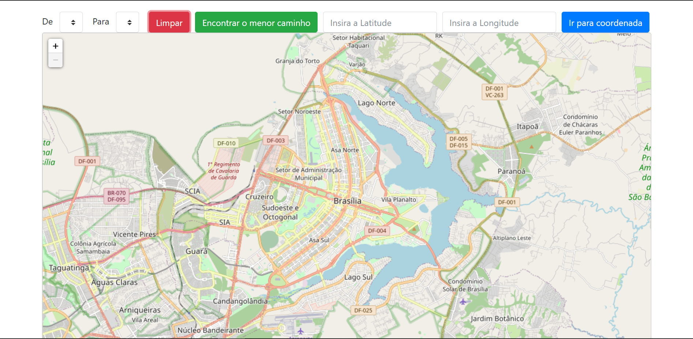
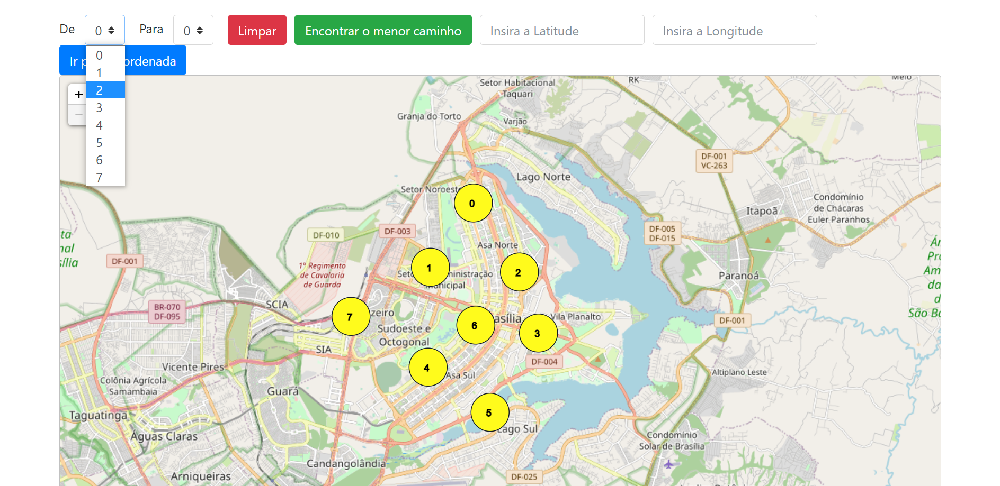
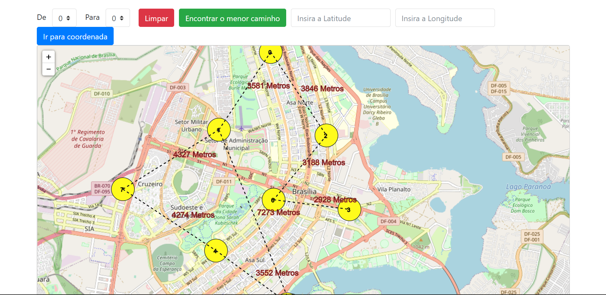
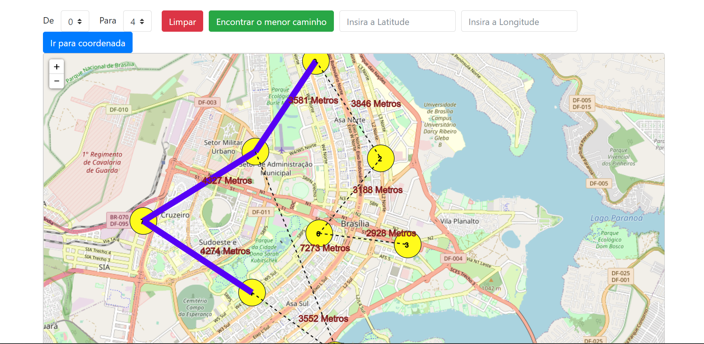

# MapShortestWay

**Número da Lista**: undefined<br>
**Conteúdo da Disciplina**: Grafos 2<br>

## Alunos
|Matrícula | Aluno |
| -- | -- |
| 19/0012200  | Douglas da Silva Monteles |
| 17/0016838  |  Lucas Lopes Xavier |

[Apresentação](https://drive.google.com/file/d/1TC3tLveqaee5OCNkwhaFvJRQB-qcMjH4/preview)

## Sobre 
Este projeto tem como objetivo permitir que seja possível visualizar o menor caminho entre dois pontos adicionados em um mapa real. Para isso, tratamos cada ponto adicionado no mapa como um nó em um grafo e então, aplicamos o algoritmo de `Dijkstra`. Se existir uma conexão entre os nós selecionados, será possível então exibir a menor distância entre eles, com base os nós que compõe o grafo.

- Se não existir uma conexão entre os nós, não será possível encontrar o menor caminho.
- É possível chegar em um ponto com base nas suas coordenadas.

## Screenshots

### Figura 1: Tela Inicial



### Figura 2: Tela com os pontos inseridos



### Figura 3: Tela com os pontos conectados



### Figura 4: Menor caminho entre os pontos 0 e 4



## Instalação 
**Linguagem**: Javascript<br>
**Framework**: Nenhum<br>

### Pré-requisitos
- Possuir um navegador

### Baixando e executando o projeto

  ```
    git clone https://github.com/projeto-de-algoritmos/Grafos2_MapShortestWay.git

    cd Grafos2_MapShortestWay    
  ```

  - Abra o arquivo `index.html` no seu navegador

## Uso 
- Você abre o index.html no navegador;

- Pra testar, você clica com o botão esquerdo do mouse (ou touchpad) pra inserir os pontos no mapa. Depois, clique com o botão direito em um ponto e depois clique em outro ponto pra conectar os nodes.

- Perceba que os pontos ficarão conectados, inclusive com a exibição da distância entre eles.

- Depois você seleciona os nodes nos campos "De" e no campo "Para" e clica em "Encontrar o menor caminho".

- Caso exista um menor caminho, será exibida uma linha azul com o menor caminho entre os pontos selecionados.
